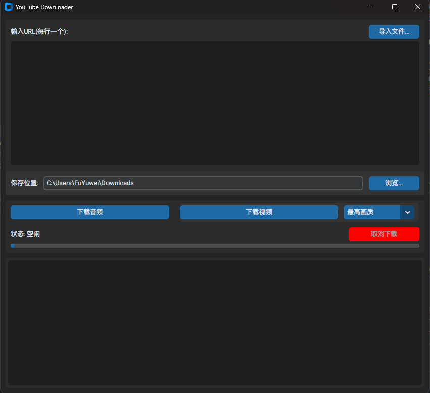
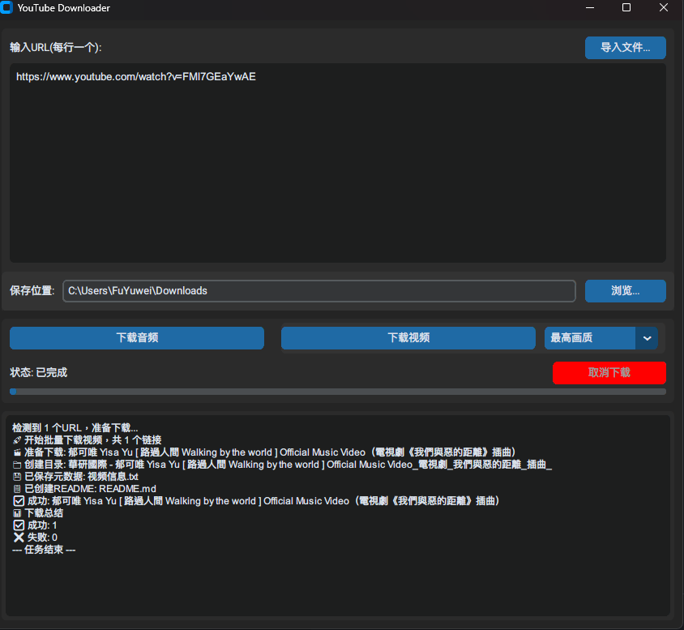

# YouTube 音视频下载器

[](https://www.python.org/downloads/)
[](https://opensource.org/licenses/MIT)

一款基于 Python 和 `yt-dlp` 开发的现代化图形界面 YouTube 音视频下载工具。它界面简洁、操作直观，旨在提供流畅的下载体验。





---

## ✨ 主要功能

-   **多种下载模式**：支持将 YouTube 视频下载为 **MP4 视频** 或 **MP3 音频**。
-   **现代化图形界面**：使用 `customtkinter` 构建，界面美观，支持亮色/暗色模式。
-   **批量处理**：
    -   支持在文本框中输入多个 URL（每行一个）进行批量下载。
    -   支持从本地 `.txt` 文件一键导入 URL 列表。
-   **灵活的画质选择**：提供多种视频画质选项（最高画质、1080p、720p、480p、最低画质）。
-   **实时反馈**：
    -   通过进度条实时显示下载进度。
    -   通过状态栏清晰展示当前操作（如：下载中、处理中、已完成）。
-   **随时取消**：在下载过程中可以随时点击“取消”按钮来中止任务。
-   **详细日志**：在日志窗口记录详细的下载过程和结果，方便追踪。
-   **智能文件管理**：下载视频时，会自动创建以“频道名 - 视频标题”命名的独立文件夹，并将视频、封面、字幕、元数据等一同保存。

---

## 🚀 如何使用 (普通用户)

如果你不关心代码，只想直接使用本工具，请按以下步骤操作：

1.  访问本项目的 [**Releases**](https://github.com/YOUR_USERNAME/YOUR_REPOSITORY/releases) 页面（请将链接中的`YOUR_USERNAME/YOUR_REPOSITORY`替换为你的 GitHub 用户名和仓库名）。
2.  在最新版本中，找到并下载名为 `youtube_downloader_vX.X.X.zip` 或 `youtube_downloader.exe` 的文件。
3.  解压文件（如果是`.zip`格式），然后直接双击运行 `gui.exe` 或 `youtube_downloader.exe` 即可启动程序。

---

## 🛠️ 如何运行 (开发者)

如果你是开发者，想要从源码运行或进行二次开发，请按以下步骤操作：

### 1. 环境准备

-   **Python**: 确保你已安装 Python 3.8 或更高版本。
-   **Git**: 确保你已安装 Git。
-   **FFmpeg**: 这是**必须**的依赖，用于音频提取和视频格式合并。
    -   前往 [FFmpeg 官网](https://ffmpeg.org/download.html) 下载。
    -   **推荐做法**: 将下载的 `ffmpeg.exe` 文件放置于项目根目录下的 `ffmpeg/bin/` 文件夹内。
    -   **或者**: 将 `ffmpeg` 的 `bin` 目录添加到你的系统环境变量 `PATH` 中。

### 2. 克隆与安装

```bash
# 1. 克隆仓库到本地
git clone https://github.com/YOUR_USERNAME/YOUR_REPOSITORY.git
cd YOUR_REPOSITORY

# 2. (推荐) 创建并激活虚拟环境
python -m venv venv
# Windows
venv\Scripts\activate
# macOS / Linux
source venv/bin/activate

# 3. 安装所有依赖
pip install -r requirements.txt
```

### 3. 启动应用

完成以上步骤后，运行以下命令即可启动 GUI 应用：

```bash
python gui.py
```

---

## 📄 许可

本项目采用 [MIT License](LICENSE) 授权。
